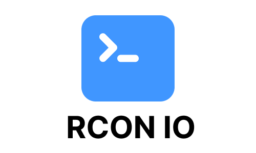

# RCON IO



A simple, but useful web panel to control CS2 servers via RCON


Have a look at these CS2 Server Docker-Images
- [joedwards32/CS2](https://github.com/joedwards32/CS2)


### Features
- Add Servers
- Add Users
- Add Map from Workshop
- Create Commands


## How to Use

```bash
git clone git@github.com:fluse/rcon-io.git
cd rcon-io
```

### With Docker
```bash
docker compose build
docker compose up -d
```

### Without Docker

```bash
npm install
npm install -g nodemon
npm run build
nodemon --exec npm start
```

open [localhost](http://localhost:3000)

## Default login
- Name: gaben
- Password: money 

# License
MIT